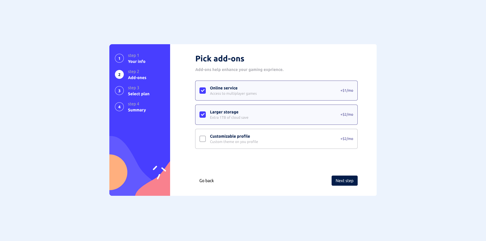

## Table Of Content

1. [How to run the project](#How-to-run-the-project)
2. [Objective](#Objective)

## How to run the project

0. Make sure you have a compatible version of Node.js installed on your machine. It is recommended to use Node.js version 18.18.0 or higher for optimal compatibility. Run this if you got nvm installed on your machine:

   - `nvm install 18.18.0`

1. Install dependencies
   - `yarn`
2. Run project in dev mode
   - `yarn start`

### Objective:

> Create a responsive wizard (Stepper) form component based on the provided design.

```
❌ Uncompleted Tasks

✅ Completed Tasks ( Checked for completion )
```

---

- <span style="color: cyan; font-size: 20px"> Subscription Form </span>

  1. ✅ Step Completion: Users are required to complete each step before advancing to the next, ensuring that all necessary information is provided.
  2. ✅ Go Back Functionality: Users can navigate back to previous steps if they need to review or edit previously entered information.
  3. ✅ Review Step: Before final submission, users have the opportunity to review all provided values to ensure accuracy.
  4. ✅ Validation: Validation is implemented for each step to ensure data integrity. Users cannot navigate to subsequent steps until the current step is completed satisfactorily.

---

- <span style="color: cyan; font-size: 20px"> Built With: </span>

  - Typescript
  - Vite
  - Eslint & Prettier
  - React
  - CSS Modules
  - Framer Motion

---

- <span style="color: cyan; font-size: 20px"> Screen shots: </span>

> Step one (personal info)


> Step Two (Select Add-ons)



> Step Three (Select Plan)


> Step Four (Preview)


> Step five (Success)


